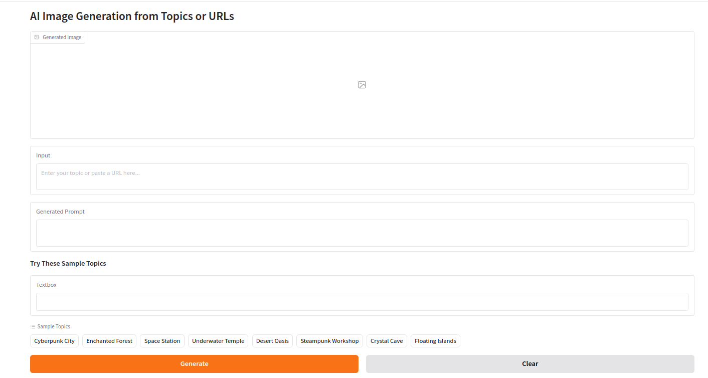
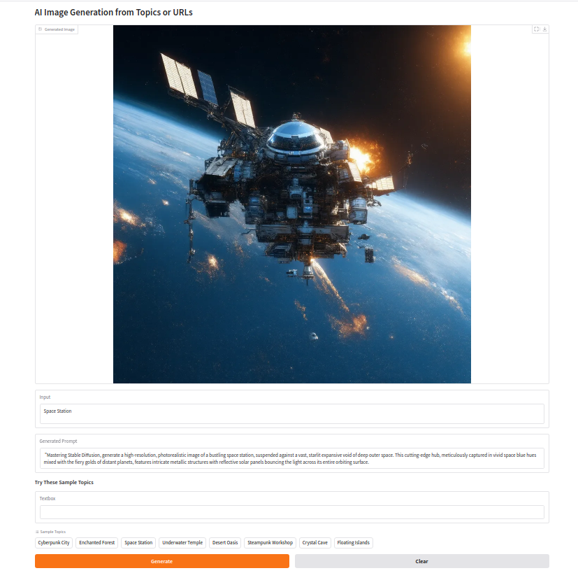

# AI Image Generator

## Features

- Generate images from text descriptions or URLs
- Automatic URL/text input detection
- Real-time generation progress bar
- View AI-generated prompts
- Sample topics gallery
- Generation history tracker

## Installation

1. Clone the repository:
```bash
git clone https://github.com/ha684/EasyImageGeneration.git
cd EasyImageGeneration
```

2. Install dependencies:
```bash
pip install -r requirements.txt
```

## Usage

1. Start the application:
```bash
python app.py
```

2. Open your web browser and go to:
```
http://localhost:7860
```

3. Generate images by:
- Entering a topic description
- Pasting an article URL
- Selecting from sample topics

## Contributing

Feel free to submit issues and enhancement requests!

## Demo



